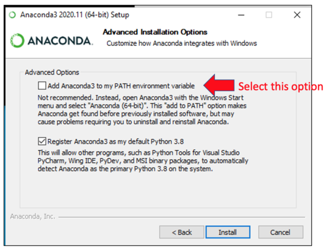
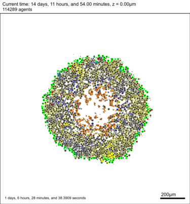
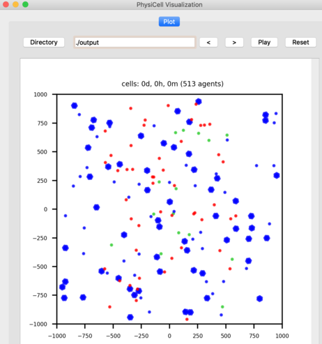
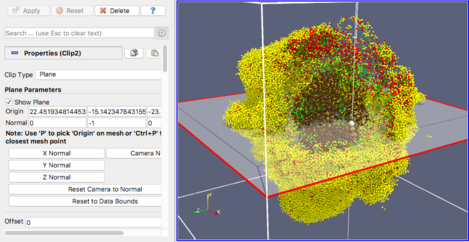

# Quickstart Guide to PhysiCell 

   * [Download](#download)
   * [Build: the basics](#build-the-basics)
      * [Windows](#windows)
      * [macOS](#macos)
      * [Linux](#linux)
   * [Python](#python)
   * [Test setup: simple projects](#test-setup-simple-projects)
   * [Test setup: advanced projects](#test-setup-advanced-projects)
   * [Visualizing Output](#visualizing-output)
      * [Browser](#browser)
      * [MATLAB/Octave](#matlaboctave)
      * [Matplotlib](#matplotlib)
      * [ImageMagick](#imagemagick)
      * [ParaView](#paraview)
   * [Support](#support)
   * [References](#references)

## Download

We currently provide 2 options for downloading the PhysiCell source code:

* https://sourceforge.net/projects/physicell/

* https://github.com/MathCancer/PhysiCell/releases

For more detailed information, see Section 3 of the User Guide (in `/documentation`)
and/or also http://www.mathcancer.org/blog/physicell-tutorials/.

<hr> <!---------------------------------------------->

## Build: the basics

PhysiCell is written in C++ and should build on any of the three major operating systems: Windows, macOS, and Linux. 
The one <b>requirement is that your compiler support OpenMP</b>. If, during your build (make) process, you get
a message like: `error: unsupported option '-fopenmp'`, you'll know your Makefile is trying to use a compiler
that doesn't support OpenMP. You may need to install an OpenMP-supported compiler and/or edit the Makefile to use it.

### Windows

The preferred way to use PhysiCell on Windows is to install MinGW64,
a minimal version of GCC that supports OpenMP (on a 64-bit computer). 

1) If you have followed the MinGW64 [installation instructions from PhysiCell v1.8.0 or before](http://mathcancer.blogspot.com/2016/01/PrepWindowsForCoding.html), we recommend that you uninstall (delete) everything from it and remove what you added to your system PATH environment variable. However, if you prefer, you can probably leave everything as is and the following steps should override your previous installation.

2) From [msys2.org](https://www.msys2.org), follow steps 1-4 (stopping before step 5). Click through the setup dialog, accepting the default suggestions.

3) In the MSYS2 console terminal, copy/paste/execute the following command (a package manager to install MINGW64 and additional libraries):
```
$ pacman -S mingw-w64-x86_64-binutils mingw-w64-x86_64-gcc mingw-w64-x86_64-headers-git  mingw-w64-x86_64-gcc-libs mingw-w64-x86_64-libwinpthread-git mingw-w64-x86_64-winpthreads-git mingw-w64-x86_64-lapack mingw-w64-x86_64-openblas mingw-w64-x86_64-libxml2 mingw-w64-x86_64-bzip2 git make
```

3) After the above completes, open the Windows application (go to Start and search for "view advanced system settings") to let you edit your Environment Variables. You have the option of editing the “User variables” or “System variables”. If it is just for your use and not intended to be shared by other 
users on this computer, then you can just edit “User variables”. Edit the “Path” variable and add three “New” 
paths. The first two pertain to the MinGW build environment; the third is for using the libRoadrunner library that's needed
by the intracellular models (ODEs) (and is a relative path from your PhysiCell main folder).

```
C:\msys64\mingw64\bin
C:\msys64\usr\bin
.\addons\libRoadrunner\roadrunner\bin
```

4) Using the same application as above, `Move up` each of the two new paths to be at the very top.


Then click `OK` on each Edit env variable window to complete the PATH update.

5) Open a *new* Command Prompt window (or Powershell, if you prefer it) and type `g++ --version` to verify it can be found:
```
PS C:\Users\heiland> g++ --version
g++.exe (Rev10, Built by MSYS2 project) 10.2.0
Copyright (C) 2020 Free Software Foundation, Inc.
```


### MacOS

Unfortunately, the C++ compiler provided by the latest version of XCode on macOS does not support OpenMP.
To resolve this, we recommend using the `brew` package manager to install a recent version of `gcc`. Follow the [brew 
installation instructions](https://docs.brew.sh/Installation.html).

After installing brew, type `brew install gcc` from a Terminal command line. This 
should install a recent version of gcc/g++ (supporting OpenMP) into `/usr/local/bin`. 
You can verify this with (note the g++ version # will change over time, but in June 2021, it was version 11):
```
$ ls -l /usr/local/bin/g++*
   ...             /usr/local/bin/g++-11@ -> ../Cellar/gcc/11.1.0_1/bin/g++-11
```

Set the following environment variables in your Terminal's shell, e.g., in the bash or zsh shell: 
```
$ export PHYSICELL_CPP=/usr/local/bin/g++-11
$ export DYLD_LIBRARY_PATH=$DYLD_LIBRARY_PATH:./addons/libRoadrunner/roadrunner/lib
```
You should permanently set these in your environment: for the bash shell: 
```
$ echo export PHYSICELL_CPP=g++-11 >> ~/.bash_profile
$ export DYLD_LIBRARY_PATH=$DYLD_LIBRARY_PATH:./addons/libRoadrunner/roadrunner/lib >> ~/.bash_profile
```
or the zsh shell:
```
$ echo export PHYSICELL_CPP=g++-11 >> ~/.zshenv
$ export DYLD_LIBRARY_PATH=$DYLD_LIBRARY_PATH:./addons/libRoadrunner/roadrunner/lib >> ~/.zshenv
```


### Linux

If you're a Linux user, you should already have an OpenMP-enabled g++.
But you will need to append the libRoadrunner relative path to your `LD_LIBRARY_PATH` (similar to the instructions for macOS) if you plan to use that for intracellular ODE models.

<hr> <!---------------------------------------------->

## Python

PhysiCell uses Python in a few different ways:
1) It is needed to install certain libraries for the intracellular models.
2) It can be used for visualization and data analysis scripts.
3) It is used for Jupyter notebook apps of PhysiCell models.
4) It can be used for parameter explorations of models.

We highly recommend installing the freely available Anaconda Python distribution. 
However, if you are already actively using Python from another distribution, you may run into possible problems by installing another one. 
In that case, you may want to reach out to the PhysiCell community for help (see Support section below).

Download/install the entire [Individual Edition](https://www.anaconda.com/products/individual). This is ~400-500MB in size because it contains a very large suite of modules. If you do not have enough free disk space, contact us for other options.

During the installation process, select the option to add Anaconda to your PATH, in spite of the "Not recommended" comment:



<!-- On macOS, you may need to insert `alias python=pythonw` into your `~/.bashrc` file (or `~/.bash_profile`). -->

<hr> <!---------------------------------------------->

## Test setup: simple projects

We provide several sample projects to help you get started. Most
of the projects are 2D models, but at least one 
is 3D (<i>cancer immunology</i>). The procedure to build and execute each of the sample projects follows the same
pattern. For example, from your Terminal, in the root PhysiCell directory/folder:
```
$ make biorobots-sample     # copy files for biorobots 
$ make                      # compile
```

Assuming the project builds without errors, you should now have an executable called `biorobots` which you can run, e.g.:
```
$ ./biorobots    #  .\biorobots.exe on Windows
...
(visualize output)
```
This will begin the simulation, write information to your terminal, and generate output files of types `.svg`, `.xml`, and `.mat`. More about those below. You can `Control-c` to kill the simulation early, if you want.

For the remaining example projects provided with PhysiCell, you would follow similar steps, but first, you may want to clean out the previous simulation's output and prepare for the new one:
```
$ make data-cleanup   # Delete output data. (Optionally, manually move it to another directory to keep it)
$ make reset          # clear out sample project 

$ make list-projects  # show all possible samples

   Build another one, e.g.:
$ make cancer-biorobots-sample    # copy new proj files
$ make                            # compile 
$ ./cancer_biorobots              # execute
...
(visualize output)
```

## Test setup: advanced projects
To build and run some of the advanced, e.g., intracellular, models:
```
$ make data-cleanup   # Delete previous output data.
$ make reset          # clear out previous sample project 
$ make list-projects  # show all possible samples

$ make ode-energy-sample
$ make
$ ./ode_energy               # execute
...
(visualize output)

$ make data-cleanup
$ make reset
$ make physiboss-cell-lines-sample
$ make
$ ./PhysiBoSS_Cell_Lines     # execute
...
(visualize output)

$ make data-cleanup
$ make reset
$ make cancer-metabolism-sample
$ make
$ ./cancer_metabolism        # execute
...
(visualize output)
```


<hr> <!---------------------------------------------->

## Visualizing Output

PhysiCell does not currently provide a GUI for visualizing output results. Our approach, for now,
is to suggest and offer guidance on using other tools, e.g. your browser, [ImageMagick](https://www.imagemagick.org), 
[MATLAB](https://www.mathworks.com/products/matlab.html), [Octave](https://octave.sourceforge.io/), 
Python, and [ParaView](https://www.paraview.org/).

### Browser

At a bare minimum, you should be able to use your browser to `File -> Open` any .svg (scalable vector graphics) file 
that your simulation generates. PhysiCell simulates transmitted light microscopy to create virtual pathology images for the .svg files. Even for 3D models, 2D cross-section images (.svg files) are generated, by 
default, using a slice through the Z=0 plane, as depicted in the following image (from the cancer-immune-sample project).



### ImageMagick

If you are able to install ImageMagick (with SVG support) on your computer, you will have access to several image processing command line
tools that will let you filter and arrange images. For example, the following commands:
```
$ montage -geometry +0+0 -tile 4x1 snapshot00000100.svg snapshot00000200.svg snapshot00000300.svg snapshot00000400.svg tmp.png
$ convert -resize 15% tmp.png out.png
```
will generate a tiled horizontal sequence of images:


ImageMagick will also let you generate an animated gif of your results, e.g.:
```
$ convert snapshot000034*.svg foo.gif
$ magick animate foo.gif    # may be huge, if original SVGs were; downsize in following steps
$ convert foo.gif -coalesce tmp.gif
$ identify snapshot00003471.svg    # get size of a single image (e.g. 1500x1605)
$ convert -size 1500x1605 tmp.gif -resize 20% small.gif
$ magick animate small.gif
```

PhysiCell 1.8.0 and later provides helper targets in the Makefile that will perform various functions (assuming you have installed ImageMagick), e.g.:
```
$ make jpeg   # convert all output/snapshot*.svg to .jpg
$ make gif    # create out.gif from output/snapshot*.svg 
$ make movie  # assuming you have ffmpeg, create out.mp4 from output/snapshot*.jpg
  You can also specify the name of the output directory, e.g.:
$ make jpeg OUTPUT=out1
```

### MATLAB/Octave

If you have access to MATLAB (or Octave), we have a [detailed tutorial](http://www.mathcancer.org/blog/working-with-physicell-snapshots-in-matlab/) on how to visualize the
MultiCellDS digital snapshots (.xml and .mat files).

### Matplotlib

We plan to provide a full-featured GUI that uses matplotlib (Python plotting). For now, we have a simple GUI that plots only the cells (the .svg files):
```
$ python beta/plot_cells.py
```
Showing output results (.svg) from the biorobots sample project:



You may also see other Python scripts in /beta that can be copied into your /output directory and run, e.g.:
```
$ python anim_svg.py
```
If you want to experiment with plotting data in the .xml and .mat files in  /output, see this 
blog post http://www.mathcancer.org/blog/python-loader/.

### ParaView

If you install ParaView, you can visualize and interact with output from 3D models (the `.mat` files). Refer to our [blog post](http://www.mathcancer.org/blog/paraview-for-physicell-part-1/) to get started.



<hr> <!---------------------------------------------->

## Support

We encourage you to join and actively use the [PhysiCell community Slack channel](https://join.slack.com/t/physicellcomm-sf93727/shared_invite/zt-qj1av6yd-yVeer8VkQaNDjDz7fF00jA). There, you can post questions [(#troubleshooting)](https://physicellcomm-sf93727.slack.com/archives/C026Y12AN7R), answer questions, and (hopefully) share successful modeling stories.

Alternatively, you can submit problem tickets at https://sourceforge.net/p/physicell/tickets/ 

Finally, please follow us on Twitter [@PhysiCell](https://twitter.com/PhysiCell) and [@MathCancer](https://twitter.com/MathCancer).

<hr> <!---------------------------------------------->

## References

* http://physicell.org/
* http://www.mathcancer.org/blog/setting-up-gcc-openmp-on-osx-homebrew-edition/ (beware the version of gcc discussed there is possibly out of date)
* http://www.mathcancer.org/blog/physicell-tutorials/
* http://www.mathcancer.org/blog/working-with-physicell-snapshots-in-matlab/
* http://www.mathcancer.org/blog/python-loader/
* https://github.com/MathCancer/PhysiCell/blob/master/documentation/User_Guide.pdf
